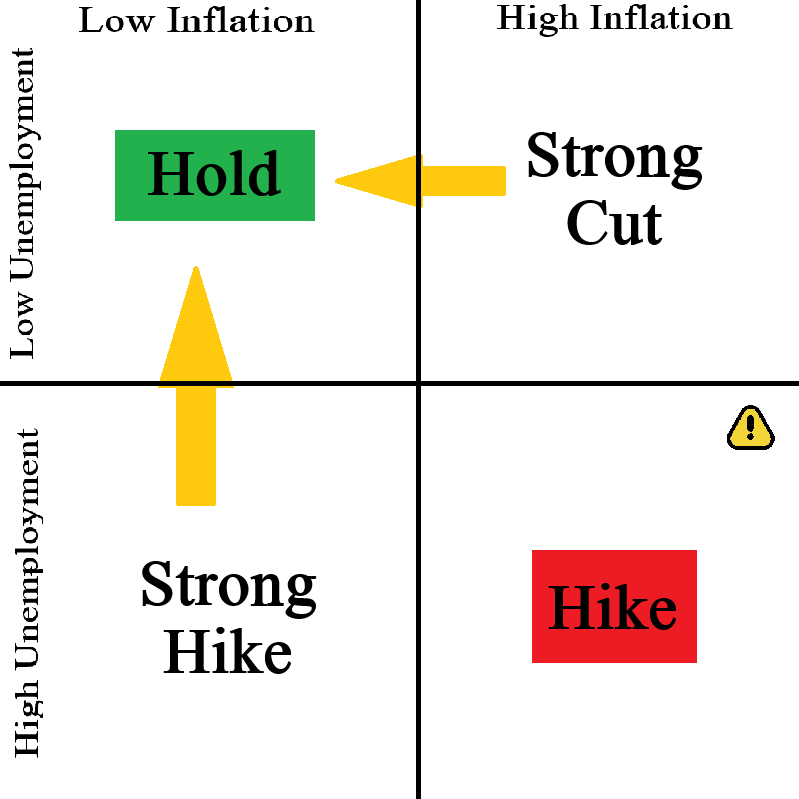

# Data

File Structure

Different folders are for collecting data on different things. 

```
├── comm                # Commodities going back ~16 years
├── crypto/             # Representative cryptocurrencies, going back ~5 years
├── equities/           # 5 years of data on representative companies
└── forex/              # Foreign exchange data going back ~15 years
```

The data folder is for:

- Fetching data from an API.
- Writing fetched data so as to never have to collect again.
- Cleaning and preprocessing raw data.
- Storing processed as `parquet` datasets for training and evaluation (so as never to have to process again).

Initial collections will be saved as `JSON` (and not pushed). Each final is saved in CSV format and converted to `parquet` before training. This data won't be pushed to GitHub right now, but can be easily fetched using the `collector` scripts. Note that you will need to get your own API keys for this. Simply place them in an `.env` file in the main directory of the project with the required API keys. You may want to see the main [`README.md`](../README.md/#) for a higher level overview.

This README includes the following details:

- [Storage Structure](#storage)
- [Data Collection](#data-collection)
- [Feature Engineering](#feature-engineering)
- [Data Storage](#data-storage)


## Storage

Each asset class (stocks, crypto, ETFs, FOREX, commodities) will have its own subfolder within this `data/` directory.

Within each subfolder,

- Raw data will be stored in the `raw/` directory of this folder. These are stored in JSON and come straight from the data provider API.
- Processed datasets are stored in the `processed/` directory.

## Data Collection

if we ever want to re-train any of the models, we'll re-run the relevant `collector.py` script in the relevant subfolder. This will re-fetch data from the APIs in order to get the most up-to-date historical information. If we don't maintain a local cache of the raw data, it'll take a while to collect all of it again.

### Equities

- We call the TwelveData API to collect historical data
- For inference, we use YFinance (since it's pretty reliable and fast), which we didn't use for historical data since it only goes back a limited time.

### Crypto

- We call the Binance API to collect historical data
- For inference, we also use Binance API, since it's extremely good all-around.

### Forex

- We use the Oanda API to collect historical data and for inference. Currencies are a lot more volatile but dependent on macroeconomic factors, so we'll be collecting ~15 years of data for training instead of 5.
- Note that the Oanda api sometimes freezes the currency prices during Holidays and around, so there'll be large gaps in the data. Don't forget to engineer features to account for this!

### Commodities

Once again, use the `OANDA` API to collect historical data and for inference. About 15 years of data is collected.

### Rates

For interest rates, we'll mostly be piecing together data from various sources, aggregated mainly by the `FRED` API, to create a dataset for training the XGBoost classification model.

## Feature Engineering

We'll be training multiple different models, each to predict a different label. As a result, each asset type will expect a (slightly) different set of features.

Equities and FOREX have time gaps (markets close at 4pm ET on weekdays and at 22:00 UTC Friday respectively, as well as holidays, etc.), so they require extra engineered features (day of the week, time since last  open, and so on) for the model to understand time context.
Here’s the feature list rewritten strictly in **DeepAR terminology**, using your current setup and conventions:

The features that will be engineered for model training are as follows:

### Equities

Written in DeepAR terminology:

**Item identifiers (`item_id`)**

* `Ticker`

These are 'superkeys' that identify each time series (i.e., each stock).

**Time features (`timestamp`)**

* `Timestamp`

This, paired with the item_id, become like keys (uniquely identify each data point).

**Target (`target`)**

* `log_return`

This is log(today's adjusted close / yesterday's adjusted close). It's what we're trying to predict. We take the logarithm to reduce stabilize variance.

**Lagged covariates (`target_lagged`)**

* `log_return_{t-1}`
* `volume_change`: log(volume_t / volume_{t-1})
* `5_day_MA`
* `50_day_MA`
* `rolling_volatility_5`
* `rolling_volatility_50`
* `S&P_log_return_{t-1}`
* `ΔVIX_{t-1}`

**Known covariates (`dynamic_feat_known`)**

* `day_of_week`: 0 = Monday, …, 6 = Sunday
* `day_of_month`: 1–31
* `quarter`: 1–4
* `S&P_log_return`


**Reminders/Notes:**

1. `log_return` is the **target** for DeepAR.
2. All rolling or lagged features go under **lagged covariates**.
3. Features derived from timestamps or other “known in advance” values go under **known covariates**.
4. Adjusted close must be used for all price-based computations.

## For Cryptocurrencies

Cryptocurrnecy changes will be predicted using similar features to equities, but with a few changes since they trade 24/7 and is more volatile.

## For FOREX

Since currencies are very stable, it's sufficient to just use historical price data without any engineered features. The model should be able to pick up on the relevant patterns from the historical data alone. Even sudden announcements, such as the tariff changes that were made during the beginning of the new US administration, currencies drop massively for a few days and then quickly revert back to baseline. Changes in currnecy value are mostly driven by longer-term trends. Only in the case of a regime collapse, war, new currency establishment, etc. do currencies change permanently. As a result, we'll only engineer "currency_age" as a feature, which is simply how long the currency pair has been traded for.

## For Commodities

For predicing the commodity prices, we'll be exclusively using the recent historical data of the commodity itself. Except for gradual technological and economic changes (which can be decently modelled using recent historical trends), most changes to commodity prices are a result of political factors, which are often sudden supply/demand shocks that are caused by wars, geopolitical decisions, natural disasters, etc. that are nearly impossible to account for, let alone predict.

## Interest Rates

Since we're using XGBoost Classification (Hike/Cut/Hold), we need to engineer features that represent the "Reaction Function" of the central bank. Once again, note that we're currently only dealing with the US Fed.

There are three "types" of factors I will consider:

- Macroeconomic factors
- Market-implied expectations
- Financial conditions & sentiment

The goal of the fed is to have unemployment rates low (around 4% is considered 'natural') while maintaining inflation at around 2% (again, that's what considered 'natural'). Since companies (and people) largely rely on banks, i.e. loans, for liquidity, the interest they pay on these loans has a big effect on how money moves. As such, the rates are used as a hinge to steer the economy. When rates are cut, borrowing becomes easier, spending increases, and we getmore jobs. If rates are hiked, borrinwg becomes harder, spending goes down, and inflation is lowered.



Basically, the indicator for whether or not looks like this:

$$
(\text{Inflation} - 2.0) - 0.5 \times (\text{Unemployment} - 4.0)
$$

(since inflation is considered "worse", it's weighted more heavily. However, the model shouldn't use this directly, it should learn the weights itself (and relationships with other factors as well) from the data.)

These factors and priorities change based on the economic climate, so sometimes the Fed might care more about unemployment, for example.

Generally, if this number is positive, we expect a hike, and if negative, a cut. Market expectations also usually have an effect, since the unpredictability is also bad for the economy (reduces risk-taking).

So, the Fed (as a board) doesn't use a single number, but a combination of things. To account for this, we need to engineer a few features that represent these factors.

I'm not an economist, so I've done my best to research (ask ChatGPT) the most commonly cited factors that influence Fed decisions. Below is a list, and I'll include the most important ones as features.

### 1. Macroeconomic Factors

Inflation and employment. These capture the core drivers of monetary policy: Inflation and Employment.

**Inflation Momentum:**

- $\text{YoY CPI} / \text{YoY PCE}$
- `Core_PCE_3M_Ann`: 3-month annualized Core PCE (for recent trends).
- `CPI_Surprise`: Difference between actual CPI and consensus forecast.

**Labour Market**

- `Unemployment_Gap`: Current Unemployment minus NAIRU (Natural Rate).
- `NonFarm_Payrolls_Delta`: Month-over-month change in jobs.
- `Wage_Growth_YoY`: Average hourly earnings (signals cost-push inflation).

**Economic Activity**
- `GDP_Nowcast`: Real-time GDP estimates (e.g., Atlanta Fed's GDPNow).
- `ISM_Manufacturing_PMI`: A leading indicator of industrial health.

### 2. Market-Implied Expectations (The "Efficient Market" Features)

The market usually prices in the move before it happens. XGBoost will rely heavily on these.

**Fed Funds Futures:** 

- `Implied_Rate_Next_Meeting`: Implied rate from the 30-day Fed Funds Futures.
- `Rate_Probability_Delta`: Daily change in the CME FedWatch probabilities for a hike vs. cut.

**Yield Curve Dynamics**

- `2Y_10Y_Spread`: Curve inversion is a primary signal for cuts/recession.
- `3M_10Y_Spread`: Cited by the Fed as their preferred recession indicator.
- `Real_Yields`: 10-year TIPS yield (represents "tightness" of policy).

### 3. Financial Conditions & Sentiment

- **SEP Dot Plot**: This is the Fed's own forecast of future rates. It's probably the single strongest indicator of what's to come. However, it's only released quarterly and tends to leak into the market beforehand. Also, it would be considered cheating since it's making the same prediction that we're trying to make.
- **Financial Conditions Index (FCI):** Use the GS or Bloomberg FCI. Higher = tighter conditions, reducing the need for a hike.
- **VIX Index:** High volatility (stress) strongly correlates with a "Hold" or "Cut" bias.
- **Stablecoin Volumes**: Since cryptocurrencies don't have earnings, dividends, or intrinsic value, the volume of stablecoins (pegged to USD) shows how much "excess" liquidity is in the economy. Formula:

Let $\Delta SC$ be the stable coin market cap delta, $SC_{t}$ be the current stablecoin market cap, and $SC_{t-1}$ be the previous market cap.


$$ \Delta \text{SC} = \frac{\text{SC}_{t} - \text{SC}_{t-1}}{\text{SC}_{t-1}}$$

We'll use this as our final feature. It needs to be a lagged feature (i.e., from the previous week) to avoid data leakage, and it should use a rolling window.

For even stronger features, we could look into expert sentiments and use NLP to parse Fed minutes, and then convert this to a numeric sentiment score. We could also use deeper economic indicators, create models to create where our current indicators are *headed*, and so forth, but that completely blow up the scale of this project.

The following features have been selected as the final 7:

- `Core_PCE_3M_Ann`     : Recent Inflation momentum
- `Unemployment_Gap`    : Current Unemployment - Natural Rate
- `CPI_Surprise_Proxy`  : Inflation deviation from expectations
- `Spread_3M_2Y`        : short-term rate expectations
- `Spread_2Y_10Y`       : long-term expectations / recession signal
- `2Y_10Y_Spread`       : Yield curve, a key recession indicator
- `Financial_Conditions_Index`: macro stress indicator

**Notes**

- **Point-in-Time Accuracy:** Don't forget to lag the macro features in order to prevent look-ahead bias.
- **Look-ahead Bias:** The `Target_Class` must be shifted backward by the interval between the feature date and the subsequent FOMC meeting.
- **Stationarity:** Log returns or first differences () should be used for non-stationary market prices to ensure the XGBoost trees split on meaningful variance.

## Data Storage

Each asset class (stocks, crypto, ETFs, FOREX, commodities) will have its own subfolder within this `data/` directory.

Within each subfolder,

- Raw data will be stored in the `raw/` directory of this folder. These are stored in JSON and come straight from the data provider API.
- Processed datasets are stored in the `processed/` directory.
